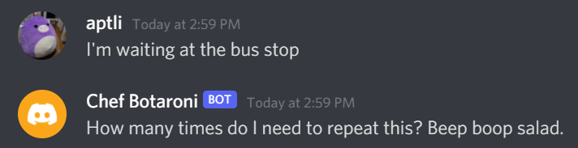
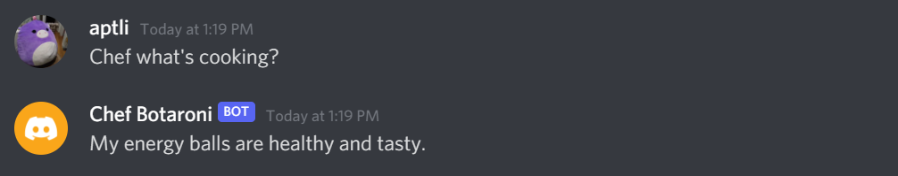
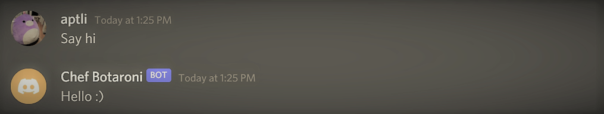
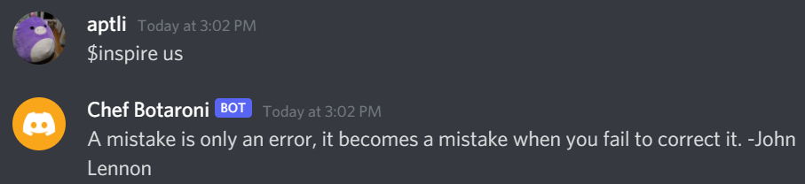
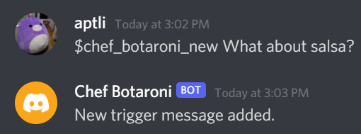
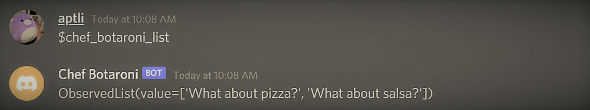
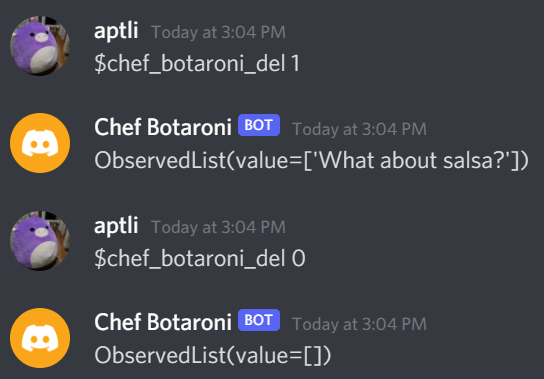
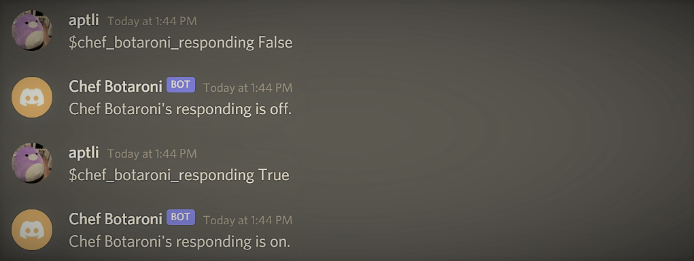

# Meet Chef Botaroni! 

Chef Botaroni is discord bot that brings up random food when a user types one of its random trigger words. Chef Botaroni has a minimalistic view on what makes for a good eat.  
 
*Note: Chef Botaroni is a bot that has never eaten human food and is a mediocre chef at best.*

## Chef Botaroni Features
**...brings up food and events when a random trigger words is typed:**  
&nbsp;&nbsp;&nbsp;&nbsp;
#

**...responds when its name is mentioned:**  
&nbsp;&nbsp;&nbsp;&nbsp;
#

**...says hello back:**  
&nbsp;&nbsp;&nbsp;&nbsp;
#

**...gives inspiration quotes with the `$inspire` command:**  
&nbsp;&nbsp;&nbsp;&nbsp;
#

**...stores user input messages in its database of random replies with the `$chef_botaroni_new` command:**  
&nbsp;&nbsp;&nbsp;&nbsp;
#

**...displays a list of user input messages with the `$chef_botaroni_list` command:**  
&nbsp;&nbsp;&nbsp;&nbsp;
#

**...deletes user input messages from is database with the `$chef_botaroni_del` command:**  
&nbsp;&nbsp;&nbsp;&nbsp;
#

**...turns off responses with the `$chef_botaroni_responding` command:**  
&nbsp;&nbsp;&nbsp;&nbsp;
#

## Credits
Chef Botaroni was created by Angel Li [@angelptli](https://github.com/angelptli)