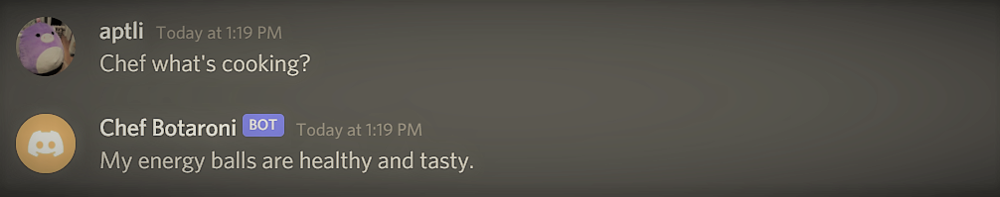
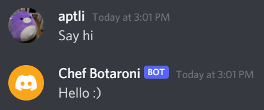
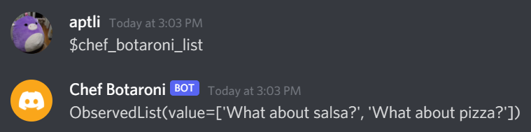
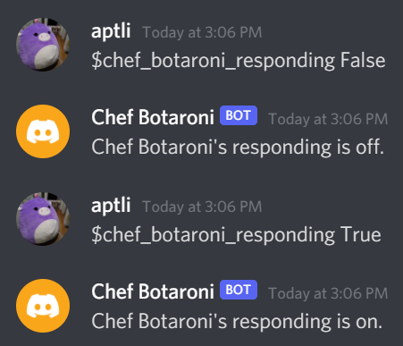

# Meet Chef Botaroni!

Chef Botaroni is discord bot that brings up random food when a user types one of its random trigger words. Chef Botaroni has a minimalistic view on what makes for a good eat.  
 
*Note: Chef Botaroni is a bot that has never eaten human food and is a mediocre chef at best.*

## Chef Botaroni Features
Chef Botaroni brings up food and events when one of its random trigger words is typed: 
 

Chef Botaroni responds when its name is mentioned: 
 

Chef Botaroni says hello back: 
 

Chef Botaroni gives inspiration quotes with the `$inspire` command: 
 

Chef Botaroni stores user input messages in its database of random replies with the `$chef_botaroni_new` command: 
 

Chef Botaroni displays a list of user input messages with the `$chef_botaroni_list` command: 
 

Chef Botaroni can delete user input messages from is database with the `$chef_botaroni_del` command: 
 

Chef Botaroni's responses can turn off with the `$chef_botaroni_responding` command: 
 

## Credits
Chef Botaroni was created by Angel Li [@angelptli](https://github.com/angelptli)